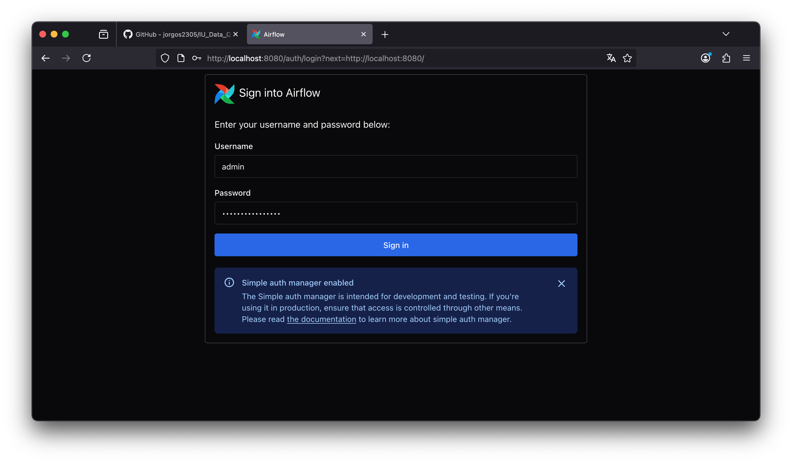
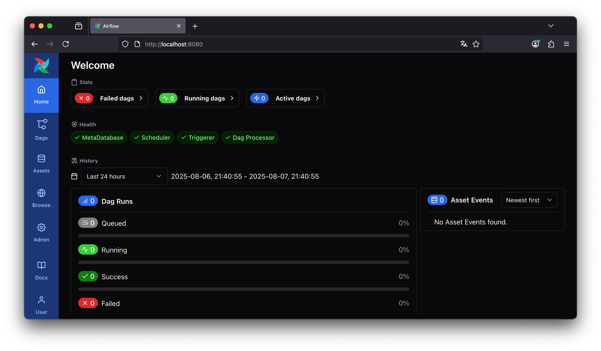
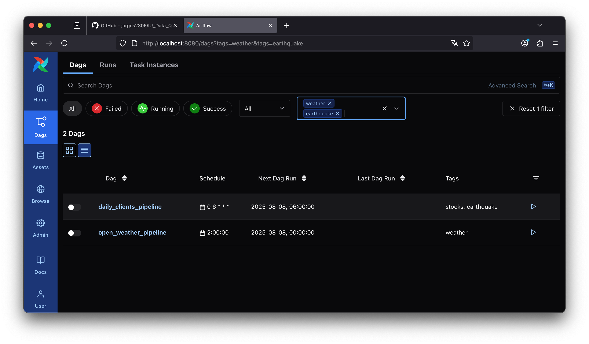

# IU International University of Applied Sciences

## Course: Data Quality and Data Wrangling (DLBDSDQDW01)
Welcome to the repository of the Data Quality and Data Wrangling course. The task for this project consists in selecting a data source, extracting and processing the information from it and storing the processed data into a format that allows for time series considerations.

### Objectives
1. Select at least three web pages which list numeric information daily. Document the selection of the data sources using a CSV file.
2. Write a python script that retrieves the data from the sources. Make the script executable on a daily basis.
3. Save the process data into a HDF5 file, making it siutable for later analysis.
4. After collecting data for a couple of day, create a visualization

## Data sources information

The data was collected from the following sources:
1. [OpenWeather](https://openweathermap.org/api/one-call-3#concept): for weather data such as temperature, humidity, pressure, etc. &rarr; Requieres API key
2. [AlphaVantage](https://www.alphavantage.co/documentation/): for stock market data &rarr; Requieres API key
2. [USGS Earthquake](https://earthquake.usgs.gov/fdsnws/event/1/): for earthquake data &rarr; Does not API key

## Conda environment
This project was implemented a conda environment. To replicate it, clone the repository and then run:

```bash
cd IU_Data_Quality_Data_Wrangling
conda env create -f environment.yml
conda activate eda
```

## Apache Airflow

We use Apache Airflow `version 3.0.3` to make the scripts run in a daily basis. For this project, it is enough to run Airflow in standalone mode. To do that, follow the next steps once you have activated the conda environment as shown above:

1. Run the following commands (make sure you are in the IU_Data_Quality_Data_Wrangling directory)
```bash
export AIRFLOW_HOME=$(pwd)/airflow
airflow standalone
```
2. Navigate to
```bash
http://localhost:8080
```
3. Enter the __user name__ and __password__ shown in the output window of you terminal.

4. On the menu on the left, go to Dags and look for the the two DAGs.

5. Activate them with the switch shown on the left of the DAG's name

